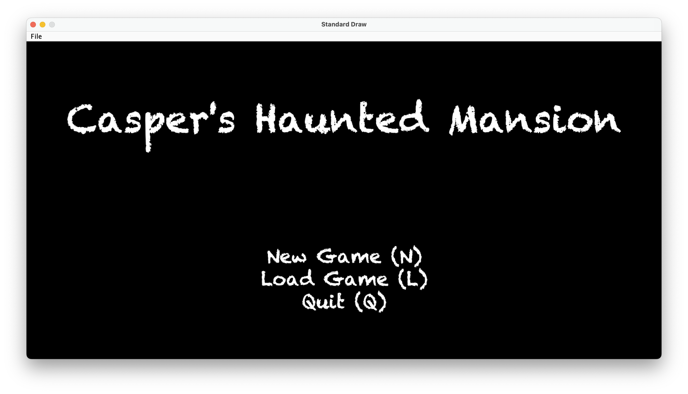
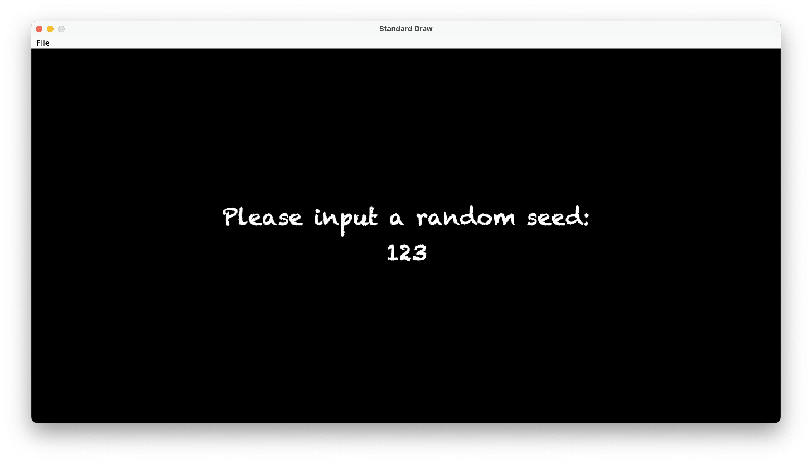
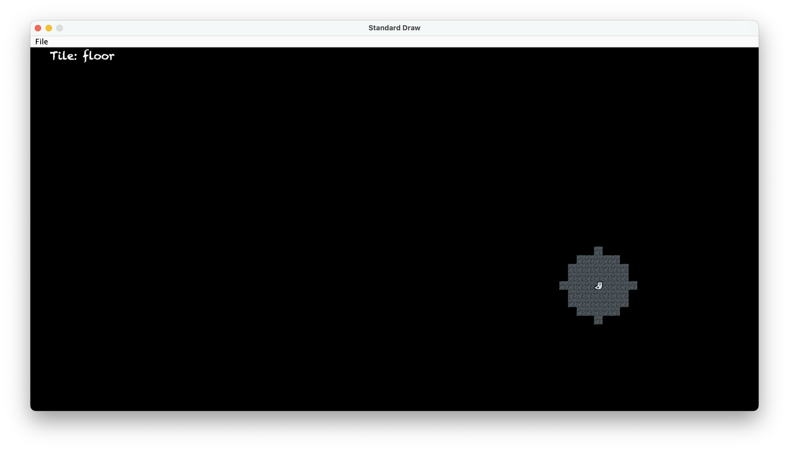
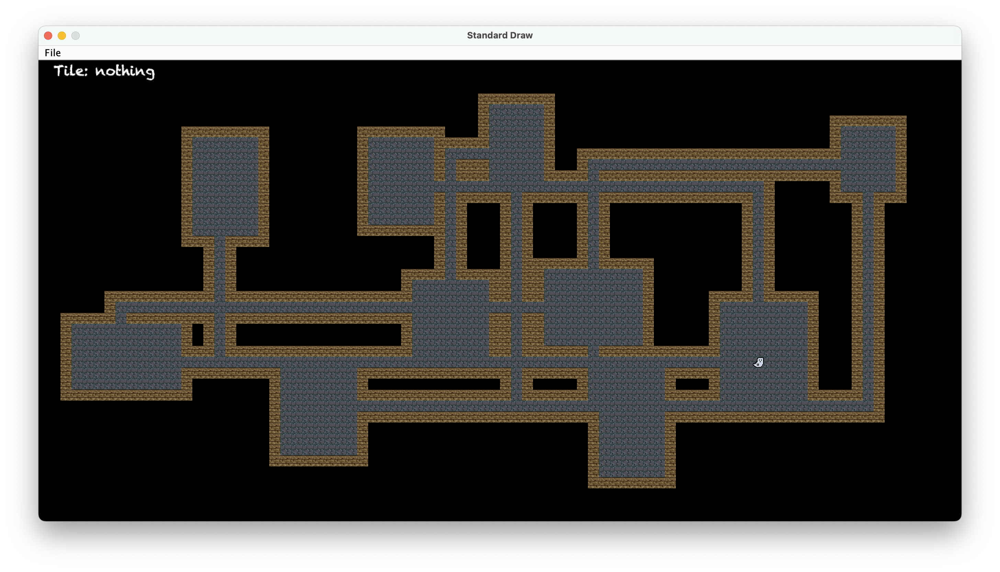

# Introduction

Welcome to Casper's Haunted Mansion, a 2D procedurally generated dungeon
exploration game (a roguelike!). In this game, you play as Casper the Ghost who
is trapped inside a haunted mansion and needs to escape. To help him do so, you
must find the escape for each room of the mansion. Little does Casper know,
there are $2^{63} - 1$ unique rooms to exit, so he'll be stuck there for a
while...

This program is written entirely in Java, and all assets were handgenerated
using [Pixilart](https://www.pixilart.com/). Tile rendering was done using the
Princeton Standard Draw Library, which can be found
[here](https://introcs.cs.princeton.edu/java/stdlib/javadoc/StdDraw.html).
I hope you have fun playing the game! 👾

# Installation

- Clone the whole repository.
- Compile the game using `javac proj3/src/Main.java`.
- Run the game using `java proj3.src.Main`
- Enjoy the game :)

# Features

Once the program is launched, a menu window will be displayed.

The following options are available:

- Press 'N' or 'n' to start a new game.
- Press 'L' or 'l' to load a saved game.
- Press 'Q' or 'q' to quit the game.

After selecting a new game, another window will be displayed, asking the user
to enter a seed. The seed is a positive number up to 9,223,372,036,854,775,807
and is used by the random generator to generate a unique game world. That means
that if you enter the same seed, the identical world be generated.

Once the seed is entered, press 'S' or 's' to generate the world. Only the
player avatar (@) and its surroundings are visible, while the rest of the map
is covered by a fog of war. Also, a status bar is diplayed on the top of the
window, displaying the level number, identification of tile over which a mouse
cursor is hovering, player's health and its inventory.

The world looks something like this - it consists of uniquely generated rooms
and corridors connecting them together. Various items are randomly generated
around the map.

<h2>Game controls</h2>

- 'w', 'a', 's', 'd' – Movement of player around the world
- ':q' – Quit the game. The game is saved and can be loaded from the main menu.
